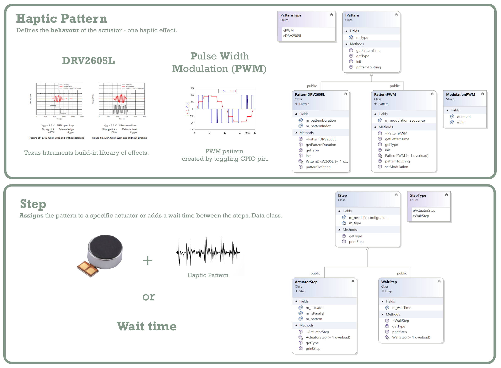

# Tactico Framework
Tactico is a **haptics framework for embedded devices**. It supports multiple embedded platforms and actuators types.

## Table of Contents
1. Introduction - Introduction covering supported devices
2. Framework Architecture - Framework architecture and classes
3. Code examples - Examples of code usage

# Introduction

**Tactico** is a hardware independent C++  framework for **haptic device setup and control**. It can be used with different types of actuators. Currently the framework  supports LRA and ERM motors, but the modular architecture makes a new hardware integration easy. The control module can be wired or wireless depending on your preference. 

## Currently Supported Hardware

**Actuators**: Linear Resonant Actuator (LRA), Eccentric Rotating Mass (ERM)

**Tested Boards**: Arduino Nano 33 BLE, nRF52840

**Actuator’s Drivers**: DRV2605LEVM-MD, GPIO Driver thorugh Pulse-Width modulation(PWM)

# Before you start

Remember that the platform is **hardware agnostic** so there are some function that you as a user need to implement in order for the framework to work correctly.

Functions to implement are placed in **Tactico\src\HardwareLayer.cpp**:

- void **waitFor**(int miliseconds) 
- void **printTactico**(const std::string s) 
- void **setPinStatusTactico**(const int pinNumber, int pinStatus) 
- void **setPinModeTactico**(const int pinNumber, int pinModeStatus) 
- void **i2c_begin**() 
- void **i2c_write_reg**(int address, int reg, int data) 
- void **i2c_endTransmission**() 
- int **i2c_read**(int address, int reg, int numberBytes) 

All these command tie the framework code to the physical hardware that is used.

# Framework Architecture


*Fig.1. A detailed view of the framework architecture.*

The detailed code documentation can be found in ***documentation\html\index.html***. In there you will find all classes with their methords and fields thoroughly explained. 

## Classes

As you could see on the above diagram there are multiple classes involved in the framework. Now we will go through all of them one by one.

### Actuator


*Fig.2. An example of an actuator alongside the infomration from the datasheet that will be needed for the implementation.*

**Actuator** class is the center point of the framework - it can be consider as a digital twin of the physical actuator. All the most important properties of an actuator need to be defined in the object of this class - **type** (LRA, ERM etc.), **rated voltage**, **peak voltage**, **resonant frequency** (for LRA) and an **Actuator Driver** instance that controls it.  

Currently two types of Actuators can be created - **ActuatorERM** and **ActuatorLRA**. They share most of the properties but they also have some specific ones. It is important to check which actuator you use so that the Actuator Driver is compatable with it (the driver can work differently depending on the actuator type).

### Actuator Driver


*Fig.3. Currently supported drivers.*

**Actuator Driver** class defines the way in which the motor is performing a haptic effect. Currently there are user can choose from two available drivers - simple GPIO driver and driver on DRV2605LEVM-MD.

**GPIO Driver**

This is the type of a simple driver where the motor is connected to a single GPIO output and controlled using **Pulse Width Modulation Pattern**. To use this driver the following functions from **HardwareLayer.cpp** need to be implemented: waitFor, printTactico, setPinStatusTactico and setPinModeTactico from (more about it [here](#before-you-start)). 

**DRV2605LEVM-MD**

This type of the driver **requires I2C communication** - connection of three pins (CLC, SDA and GND), as well as implementation of I2C related commands in **HardwareLayer.cpp** file (more about it [here](#before-you-start)). In this particular class there is a forth hardware connection needed - GPIO **"GO" pin** that will trigger the haptic effect. 

**ActuatorDriverDRV2605LEVM** uses the DRV2605L list of registers (specified in **DRV2605L_REG.h**) and the list of haptic effects (**DRV2605L_EFFECTS.h**). 

This type od actuator driver **need preconfiguration** before any haptic effect is played! The preconfiguration allows the user to store an effect sequence in the physical DRV2605L driver's memory and play it when the "GO" pin is triggered ("GO" pin need to go HIGH). 

Therefore, when this type of actuator is used as a part of the **Action** class instance, **configure() function need to be called before play()** (or configureAndPlay() which triggers the configuration and then the play of an Action). The advantage of the preconfiguration is that in this way Action Steps can be triggered in parallel (more about it [here](#action)). 

### Pattern & Step


*Fig.4. Haptic Pattern and Step classes.*

**Pattern**

Not every pattern is suitable for every actuator or even actuator driver. 
PWM Pattern and DRV2605L pattern type. The table belows presents what patterns are available for each actuator-driver combination.

| Actuator/Driver | Actuator Driver DRV2605LEVM | Actuator Driver GPIO |
| --------------- | --------------------------- | -------------------- |
| LRA             | Pattern DRV2605L            | -                    |
| ERM             | Pattern DRV2605L            | Pattern PWM          |

*Tab. 1. Table representing what available pattern can be used with a specific actuator-driver combination.*

Two available patterns represent entirely different approach. **DRV2605L Pattern** is simply holding an index of the pattern that will be played from the library, while PWM pattern is more complex. PWM pattern is created by hand by the user with Modulation structure. The modulation is defined by the duration of the pulse and if it is a binary 1 or 0 pulse.


*Fig.5. The explanation of ModulationPWM structure.*

**Step**

Indivitudual activation of the actuator or wait command.

### Action

**Action**
Combines steps

### Haptic Device
You can combine all the above classes into one device. In that way you can control all the actuators and action at the same time.


# Code examples  
## Basic
### Creating an Actuator Driver

All the Drivers, Actuators, Patterns and Action instances are created with the use of **shared pointer**. In that way it is easier to manage them as they are passed to various functions in the runtime. 

- GPIO Driver

``` cpp

// pin that is connected to the actuator and supports Pulse Width-Modulation
int driverPinGPIO = 2;
// GPIO Driver - uses PMW patterns
std::shared_ptr<ActuatorDriverGPIO> driver_1 = 
    std::make_shared<ActuatorDriverGPIO>(driverPinGPIO);
```
- I2C Driver - DRV2605LEVM-MD
``` cpp
// DRV2605L evaluation board contains multiple DRV2605L drivers.
// Therefore the driver ID need to be specified.
int driverID = 0;
int driverGoPin = 12;

// DRV2605L Driver - communicated through I2C and uses DRV2605L effect library pattern
std::shared_ptr<ActuatorDriverDRV2605LEVM> driver_2 =
    std::make_shared<ActuatorDriverDRV2605LEVM>(driverID, driverGoPin);
```

### Assiging an Actuator

- ERM Actuator
``` cpp
std::shared_ptr<ActuatorERM> actuator_1 =
    std::make_shared<ActuatorERM>(driver_1, 2, 3);

```
- LRA Actuator
``` cpp
std::shared_ptr<ActuatorLRA> actuator_2 =
    std::make_shared<ActuatorLRA>(driver_2, 2.5, 2.7, 100, "myLRA");
```

### Assiging a Pattern

- PWM Pattern
``` cpp
function test() {
  console.log("notice the blank line before this function?");
}
```
- DRV2605L Pattern (based on Texas Intruments Effect Library)
``` cpp
function test() {
  console.log("notice the blank line before this function?");
}
```
### Creating an action Step
- Actuator Step
``` cpp
function test() {
  console.log("notice the blank line before this function?");
}
```
- Wait Step
``` cpp
function test() {
  console.log("notice the blank line before this function?");
}
```

### Creating an Action


### Creating a Haptic Device

# Useful Links
 
- [Platformio for VS](https://docs.platformio.org/en/latest/integration/ide/visualstudio.html)

``` cpp
function test() {
  console.log("notice the blank line before this function?");
}
```