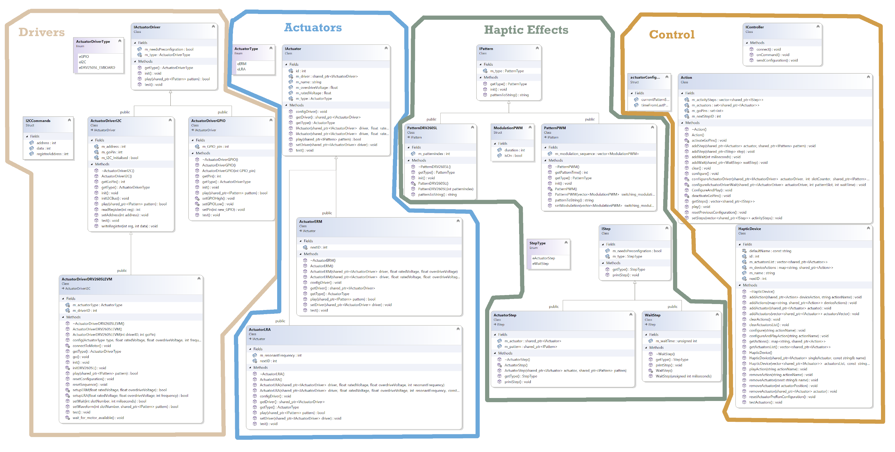

# Tactico Framework
Tactico is a **haptics framework for embedded devices**. It supports multiple embedded platforms and actuator types.

## Table of Contents
1. Introduction 
2. Currently Supported Hardware
3. Framework Architecture 
4. Code Examples

# Introduction

**Tactico** is a hardware independent C++  framework for **haptic device setup and control**. It is suitable for different types of actuators and actuator drivers. Currently, the framework supports LRA and ERM motors, but the modular architecture makes new hardware integration easy. The control module can be wired or wireless, depending on your preference. 

# Currently Supported Hardware

**Actuators**: Linear Resonant Actuator (LRA), Eccentric Rotating Mass (ERM)

**Tested Boards**: Arduino Nano 33 BLE, nRF52840

**Actuator’s Drivers**: DRV2605LEVM-MD, GPIO Driver thorugh Pulse-Width modulation(PWM)

# Before you start

Remember that the platform is **hardware agnostic**, so there are some functions that you as a user need to implement for the framework to work correctly.

Functions to implement can be found in **Tactico\src\HardwareLayer.cpp**:

- void **waitFor**(int miliseconds) 
- void **printTactico**(const std::string s) 
- void **setPinStatusTactico**(const int pinNumber, int pinStatus) 
- void **setPinModeTactico**(const int pinNumber, int pinModeStatus) 
- void **i2c_begin**() 
- void **i2c_write_reg**(int address, int reg, int data) 
- void **i2c_endTransmission**() 
- int **i2c_read**(int address, int reg, int numberBytes) 

All these commands tie the framework code to the utilised physical hardware.

# Framework Architecture


*Fig.1. A detailed view of the framework architecture.*

The detailed code documentation can be found in ***documentation\html\index.html***. In there, all classes with their methods and fields are thoroughly explained. 

As shown in the above diagram, numerous classes are involved in the framework. Below you will find a general explanation of each of them.

## Actuator Class


*Fig.2. An example of an actuator alongside the information from the datasheet that will be needed for the implementation.*

**Actuator** class is the centre point of the framework - it can be considered a digital twin of the physical actuator. All the most important properties of an actuator need to be defined in the object of this class - **type** (LRA, ERM etc.), **rated voltage**, **peak voltage**, **resonant frequency** (for LRA) and an **Actuator Driver** instance, that controls it.  

Currently, two types of Actuators can be created - **ActuatorERM** and **ActuatorLRA**. They share most of the properties but also have some specific ones. It is essential to check which actuator you use so that the Actuator Driver is compatible with it (the driver can work differently depending on the actuator type).

The framework supports testing the connected actuators by calling the **test()** command. It will send a single vibration test to the motor. It is highly recommended to test the hardware before processing with further framework implementation. 

## Actuator Driver Class


*Fig.3. Currently supported drivers.*

**Actuator Driver** class defines the way in which the motor performs a haptic effect. Currently, users can choose from two available drivers - a simple GPIO driver and a driver from the DRV2605LEVM-MD board.

**GPIO Driver**

GPIO Driver is a simple driver with the motor connected to a single GPIO output and controlled using **Pulse Width Modulation Pattern**. In order to use this driver, the following functions from **HardwareLayer.cpp** need to be implemented: waitFor, printTactico, setPinStatusTactico and setPinModeTactico from (more about it [here](#before-you-start)). 

**DRV2605LEVM-MD**

The DRV2605LEVM-MD driver **requires I2C communication** - connection of three pins (CLC, SDA and GND), as well as the implementation of I2C related commands in **HardwareLayer.cpp** file (more about it in [Before you start section](#before-you-start)). In this particular class, a fourth hardware connection is needed - GPIO **"GO" pin** that will trigger the haptic effect. 

**ActuatorDriverDRV2605LEVM** uses the DRV2605L list of registers (specified in **DRV2605L_REG.h**) and the list of haptic effects (**DRV2605L_EFFECTS.h**). 

It **needs pre-run configuration** before any haptic effect is played! The configuration allows the user to store an effect sequence in the physical DRV2605L driver's memory and play it when the "GO" pin is triggered (the "GO" pin needs to go HIGH). 

Therefore, when this type of actuator is used as a part of the **Action** class instance, the **configure() function needs to be called before play()** (or configureAndPlay(), which triggers the configuration and then the play of an Action). The advantage of the pre-run configuration is that Action Steps can be triggered in parallel (more about it in [Action Class section](#action)). 

## Pattern & Step Classes


*Fig.4. Haptic Pattern and Step classes.*

**Pattern**

Not every pattern is suitable for every actuator or even the actuator's driver. 
The table below presents what patterns are available for each actuator-driver combination.

| Actuator/Driver | Actuator Driver DRV2605LEVM | Actuator Driver GPIO |
| --------------- | --------------------------- | -------------------- |
| LRA             | Pattern DRV2605L            | -                    |
| ERM             | Pattern DRV2605L            | Pattern PWM          |

*Tab. 1. Table representing what available pattern can be used with a specific actuator-driver combination.*

Two available patterns represent entirely different approaches. **DRV2605L Pattern** is simply holding an index of the pattern that will be played from the library, while the PWM pattern is more complex. **PWM pattern** is created manually by the user with a ModulationPWM structure. The modulation is defined by the duration of the pulse and if it is a binary 1 or 0 pulse.

The most significant advantage of the Pattern class is that it can be assigned to many actuators simultaneously. The pattern instance is **created once**, and all of the actuators of a suitable type can use it. 


*Fig.5. The explanation of ModulationPWM structure.*

**Step**

**Step** can be considered an individual activation of the actuator or a Wait command. Steps are a data class that only stores information about the objects involved in the step, and to play them, they need to be combined into the Action.

The step can be configured to be played in parallel. This functionality is available only for actuators that drivers allow pre-run configuration (e.g. DRV2605L but **NOT** DriverGPIO). The step parallelisation property needs to be **assigned when the step is created**!

More about Steps implementation combinations can be found in [Action Class section](#action).
## Action Class


*Fig.6. Example of creating parallel and non-parallel actions. The step parallelisation property needs to be assigned when the step is created!*

The **Action** class combines previously explained Steps into a sequence of haptic effects. All available actuator types and patterns can be combined to create a new haptic experience. 

As mentioned in [Actuator Driver Class section](#actuator-driver-class), **some drivers require pre-run configuration** to play a pattern. Therefore it is necessary for each Action to either call:

- **configure()** and **play()** consecutively

OR

- **configureAndPlay()**, which will configure all involved actuators and immediately play the Action

The Action can involve some of the steps played in parallel. The step parallelisation property can be assigned only during the Step object creation. However, it is limited to the specific motor drivers that allow pre-run configuration(e.g. works with DRV2605L, but **NOT** with GPIO driver). 

To keep the Action clean, it is recommended to call **resetPreviousConfiguration()** each time after the action is played (unless it will be repeated). In that way, pre-run memory will be reset, and non of the previously played actuator will be accidentally triggered by the same GO pin as assigned to the other actuators (which is the case when using the DRV2605LEVM board). This function is not automatically activated if the Action is set up once and used multiple times in a row. 

An Action can become a part of a Haptic Device. 

## Haptic Device Class


*Fig.7. A graphical representation of a haptic device with Actuators and Actions assigned.*

You can combine all the above classes into one **Haptic Device** entity. In that way, you can control all the actuators and actions simultaneously. 

As previously explained in the Action section, it is recommended to reset the previous pre-run configuration if not used subsequently. When using Haptic Device, you can make sure that all actuators have clean pre-run configuration by using **resetActuatorsPreRunConfiguration()**.

## Controller Class

The framework supports the creation of a custom external controller to control the Haptic Device behaviour. Currently, no controller is implemented, but the framework's flexibility allows it to be easily added. 

# Code examples  
## Basic
### Creating an Actuator Driver

All the Drivers, Actuators, Patterns and Action instances are created with the use of **shared pointer**. In that way it is easier to manage them as they are passed to various functions in the runtime. 

- GPIO Driver

``` cpp

// pin that is connected to the actuator and supports Pulse Width-Modulation
int driverPinGPIO = 2;
// GPIO Driver - uses PMW patterns
std::shared_ptr<ActuatorDriverGPIO> driver_1 = 
    std::make_shared<ActuatorDriverGPIO>(driverPinGPIO);
```
- I2C Driver - DRV2605LEVM-MD
``` cpp
// DRV2605L evaluation board contains multiple DRV2605L drivers.
// Therefore the driver ID need to be specified.
int driverID = 0;
int driverGoPin = 12;

// DRV2605L Driver - communicated through I2C and uses DRV2605L effect library pattern
std::shared_ptr<ActuatorDriverDRV2605LEVM> driver_2 =
    std::make_shared<ActuatorDriverDRV2605LEVM>(driverID, driverGoPin);
```

### Assiging an Actuator

- ERM Actuator
``` cpp

// the standard DC voltage for the actuator
float ratedVoltage = 2.0;
// the maximum allowable DC voltage
float overdriveVoltage = 2.5;
// optional - custom name will be prited alongside logs refering to the
// actuator
std::string customName = "myERM_1";

std::shared_ptr<ActuatorERM> actuator_1 = std::make_shared<ActuatorERM>(
    driver_1, ratedVoltage, overdriveVoltage, customName);

```
- LRA Actuator
``` cpp

// the standard DC voltage for the actuator
float ratedVoltage = 2.0;
// the maximum allowable DC voltage
float overdriveVoltage = 2.5;
// optional - custom name will be prited alongside logs refering to the actuator
std::string customName = "myLRA_1";

std::shared_ptr<ActuatorLRA> actuator_2 =
    std::make_shared<ActuatorLRA>(driver_2, ratedVoltage, overdriveVoltage, 100, customName);
```

### Assiging a Pattern

- PWM Pattern
``` cpp
function test() {
  console.log("notice the blank line before this function?");
}
```
- DRV2605L Pattern (based on Texas Intruments Effect Library)
``` cpp
function test() {
  console.log("notice the blank line before this function?");
}
```
### Creating an action Step
- Actuator Step
``` cpp
function test() {
  console.log("notice the blank line before this function?");
}
```
- Wait Step
``` cpp
function test() {
  console.log("notice the blank line before this function?");
}
```

### Creating an Action


### Creating a Haptic Device

# Useful Links
 
- [Platformio for VS](https://docs.platformio.org/en/latest/integration/ide/visualstudio.html)

- [DRV2605L Documentation](https://www.ti.com/lit/ds/symlink/drv2605l.pdf?ts=1672415752878)
  
- 


``` cpp
function test() {
  console.log("notice the blank line before this function?");
}
```